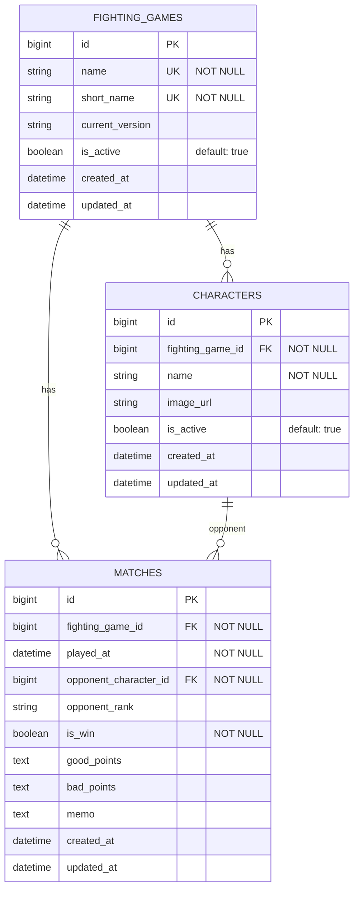

# ER図

## リレーションの説明

1. FIGHTING_GAMES と CHARACTERS
   - 1対多の関係
   - 1つのゲームに対して複数のキャラクターが存在
   - キャラクターは必ず1つのゲームに属する

2. FIGHTING_GAMES と MATCHES
   - 1対多の関係
   - 1つのゲームに対して複数の対戦記録が存在
   - 対戦記録は必ず1つのゲームに属する

3. CHARACTERS と MATCHES
   - 1対多の関係
   - 1つのキャラクターに対して複数の対戦記録が存在（相手キャラクターとして）
   - 対戦記録は必ず1つの相手キャラクターを持つ 